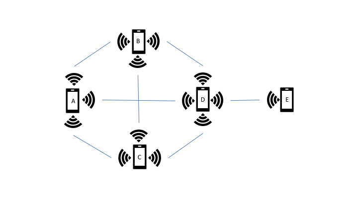
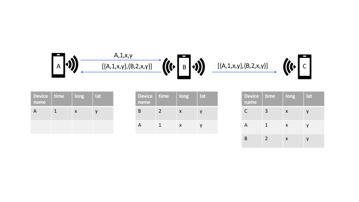
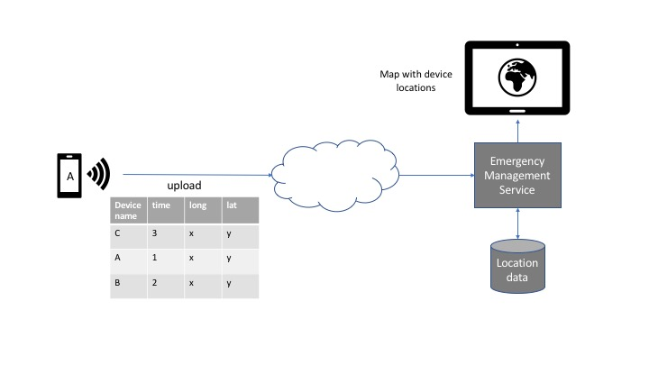

# Rescunet
An answer to the 2019 Call for Code Challenge

## Team
| Name | Email|
|:-----|:-----|
| Hilton Lem | hlem@ca.ibm.com |
| Rui Ming Xiong | ruimingxiong@ibm.com |
| Alex Hudici | dhudici@ca.ibm.com |

# Introduction
In a perfect world, rescuers would know the location and status of people in emergency situations. Rescunet is kind of like the hazard button on your car, but on your phone. It's an app that helps survivors with no internet access or cell signal be found or to find other people. 

This document will describe the architecture for delivering a location solution built on top of a wireless mesh network using standard off-the-shelf phones without the need for internet or cellular access.

## Technology
* WiFi Direct
* GPS
* IBM Cloud Functions

## Development Environment
Android Studio
https://developer.android.com/studio

## High Level Architecture

Using Wifi-Direct, a mobile phone can broadcast its current GPS location to anyone within wifi range. Each phone will also perform peer discovery continuously.

Each mobile phone will maintain a table of peers that it has discovered and will broadcast its table to each peer. Upon receiving a payload from a peer, it will be merged with its local table. Broadcasting will occur on an interval.

Once any node in the mesh network gains internet access, the entire location table will be uploaded to the emergency management service in the cloud for plotting on a map.

For the backend source see https://github.ibm.com/dhudici/rescunetbackend

# TODO
- User guide
- GPS permission pop-up
- better long-lat display styling

# Roadmap Items

- For points that are off the graph, show an arrow indicating direction. Arrows are not clickable.
- Sending pieces of information other than coordinates, such as direct messaging. This feature would use the last three characters to indicate message type.
- Resolving conflicts - if I receive data about my ID that does not match what I have known myself, then something is wrong. Change my ID.
- Intelligent broadcasting - devices can intelligently help devices around them.
- Passive mode - if GPS does not work, still be able to send messages or other similar information.
- GPS trails
- Dot labels

## License

This project is licensed under the Apache 2 License - see the [LICENSE.md](LICENSE.md) file for details
